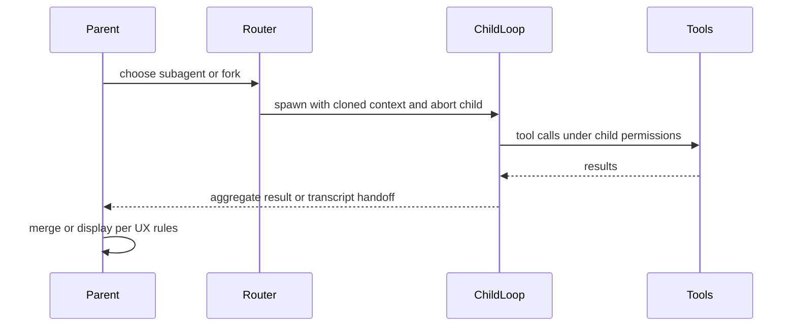

# Diagram: delegation flow

Delegated work re-enters the **same core loop** with **isolated context** unless a separate process is explicitly documented.

## Notes

- Cache or prompt parameters may need alignment between parent and child; see `architecture/05-delegation-and-execution.md`.
- Specialist **documentation personas** for delegated slices live under `subagents/`; the universal dispatcher is `commands/agent-hub.md`.
