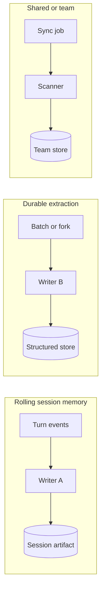

# Diagram: memory pipelines

Three conceptual pipelines; your codebase may implement subsets.

## Notes

- Writers must not fight over the same file without coordination; see `architecture/08-memory-pipelines.md`.
