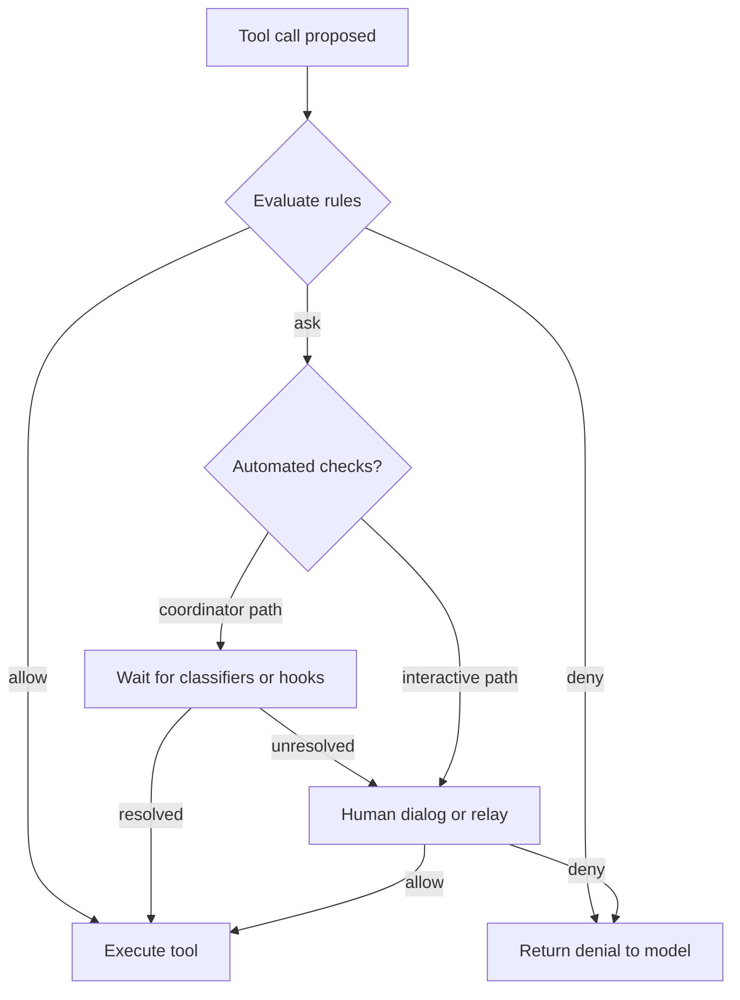

# Diagram: permission flow (simplified)

## Notes

- Remote or channel relays may substitute for local dialog; see `architecture/02-policy-and-permissions.md` and `10-observability-and-human-gates.md`.
