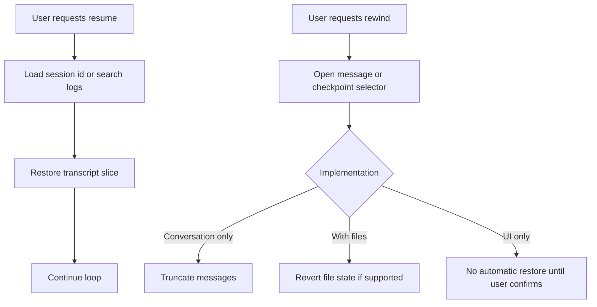

# Diagram: resume vs rewind

```mermaid
flowchart TD
  R[User requests resume] --> L[Load session id or search logs]
  L --> M[Restore transcript slice]
  M --> N[Continue loop]

  W[User requests rewind] --> U[Open message or checkpoint selector]
  U --> V{Implementation}
  V -->|Conversation only| X[Truncate messages]
  V -->|With files| Y[Revert file state if supported]
  V -->|UI only| Z[No automatic restore until user confirms]
```

## Notes

- Validate actual behavior in code; see `architecture/09-recovery-and-resume.md`.
