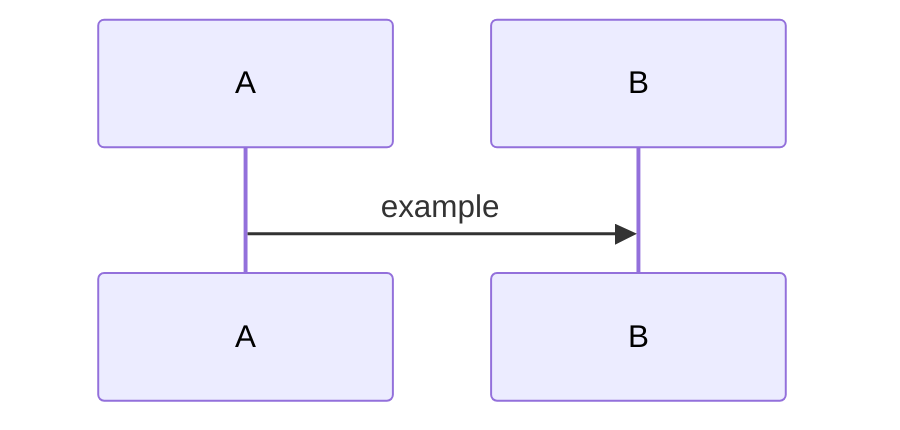

# Sequence note: [feature name]

Use for documenting a flow before or after coding. Replace actors with your modules.

## Actors

- A:
- B:
- C:

## Preconditions

## Steps

| Step | Actor | Action | Data / contract |
|------|-------|--------|-----------------|
| 1 | | | |
| 2 | | | |
| 3 | | | |

## Postconditions

## Failure and recovery

## Observability

## Related diagram

Link to `diagrams/*.md` or embed Mermaid below.

